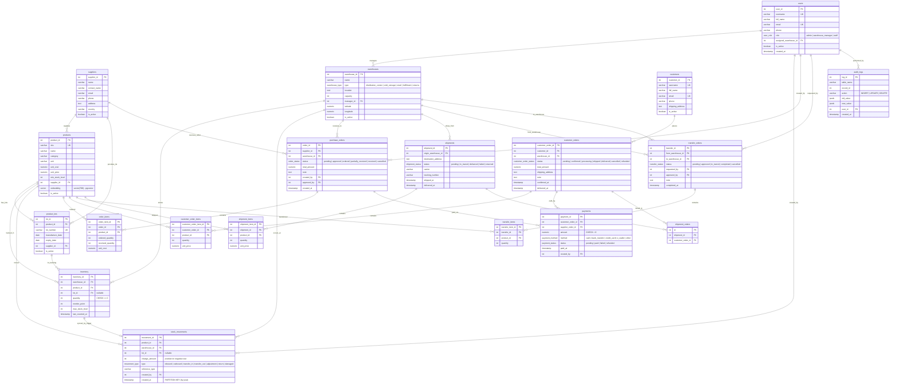

# ERD Diagram — Smart Logistics System

```mermaid
erDiagram
    users {
        int user_id PK
        varchar username UK
        varchar full_name
        varchar email UK
        varchar phone
        user_role role "admin | warehouse_manager | staff"
        int assigned_warehouse_id FK
        boolean is_active
        timestamp created_at
    }

    suppliers {
        int supplier_id PK
        varchar name
        varchar contact_name
        varchar email
        varchar phone
        text address
        varchar country
        boolean is_active
    }

    warehouses {
        int warehouse_id PK
        varchar name
        warehouse_type type "distribution_center | cold_storage | retail | fulfillment | returns"
        text location
        int capacity
        int manager_id FK
        numeric latitude
        numeric longitude
        boolean is_active
    }

    products {
        int product_id PK
        varchar sku UK
        varchar name
        varchar category
        varchar unit
        numeric unit_cost
        numeric unit_price
        int min_stock_level
        int supplier_id FK
        vector embedding "vector(768) - pgvector"
        boolean is_active
    }

    product_lots {
        int lot_id PK
        int product_id FK
        varchar lot_number UK
        date manufacture_date
        date expiry_date
        int supplier_id FK
        boolean is_active
    }

    inventory {
        int inventory_id PK
        int warehouse_id FK
        int product_id FK
        int lot_id FK "nullable"
        int quantity "CHECK >= 0"
        int reorder_point
        int max_stock_level
        timestamp last_counted_at
    }

    stock_movements {
        int movement_id PK
        int product_id FK
        int warehouse_id FK
        int lot_id FK "nullable"
        int change_amount "positive=in negative=out"
        movement_type type "inbound | outbound | transfer_in | transfer_out | adjustment | return | damaged"
        varchar reference_type
        int created_by FK
        timestamp created_at "PARTITION KEY (by year)"
    }

    purchase_orders {
        int order_id PK
        int supplier_id FK
        int warehouse_id FK
        order_status status "pending | approved | ordered | partially_received | received | cancelled"
        numeric total_amount
        text note
        int created_by FK
        int approved_by FK
        timestamp created_at
    }

    order_items {
        int order_item_id PK
        int order_id FK
        int product_id FK
        int ordered_quantity
        int received_quantity
        numeric unit_cost
    }

    customers {
        int customer_id PK
        varchar username UK
        varchar full_name
        varchar email UK
        varchar phone
        text shipping_address
        boolean is_active
    }

    customer_orders {
        int customer_order_id PK
        int customer_id FK
        int warehouse_id FK
        customer_order_status status "pending | confirmed | processing | shipped | delivered | cancelled | refunded"
        numeric total_amount
        text shipping_address
        text note
        timestamp confirmed_at
        timestamp delivered_at
    }

    customer_order_items {
        int customer_order_item_id PK
        int customer_order_id FK
        int product_id FK
        int quantity
        numeric unit_price
    }

    transfer_orders {
        int transfer_id PK
        int from_warehouse_id FK
        int to_warehouse_id FK
        transfer_status status "pending | approved | in_transit | completed | cancelled"
        int requested_by FK
        int approved_by FK
        text note
        timestamp completed_at
    }

    transfer_items {
        int transfer_item_id PK
        int transfer_id FK
        int product_id FK
        int quantity
    }

    shipments {
        int shipment_id PK
        int origin_warehouse_id FK
        text destination_address
        shipment_status status "pending | in_transit | delivered | failed | returned"
        varchar carrier
        varchar tracking_number
        timestamp shipped_at
        timestamp delivered_at
    }

    shipment_items {
        int shipment_item_id PK
        int shipment_id FK
        int product_id FK
        int quantity
        numeric unit_price
    }

    shipment_orders {
        int id PK
        int shipment_id FK
        int customer_order_id FK
    }

    payments {
        int payment_id PK
        int customer_order_id FK
        int supplier_order_id FK
        numeric amount "CHECK > 0"
        payment_method method "cash | bank_transfer | credit_card | e_wallet | other"
        payment_status status "pending | paid | failed | refunded"
        timestamp paid_at
        int created_by FK
    }

    audit_logs {
        int log_id PK
        varchar table_name
        int record_id
        varchar action "INSERT | UPDATE | DELETE"
        jsonb old_value
        jsonb new_value
        int user_id FK
        timestamp created_at
    }

    %% ─── Relationships ───────────────────────────────────

    users ||--o{ warehouses : "manages"
    users ||--o{ stock_movements : "created_by"
    users ||--o{ purchase_orders : "created_by"
    users ||--o{ transfer_orders : "requested_by"
    users ||--o{ audit_logs : "performed_by"

    suppliers ||--o{ products : "supplies"
    suppliers ||--o{ product_lots : "provides_lot"
    suppliers ||--o{ purchase_orders : "receives_order"

    warehouses ||--o{ inventory : "stores"
    warehouses ||--o{ stock_movements : "occurs_at"
    warehouses ||--o{ purchase_orders : "receives_to"
    warehouses ||--o{ shipments : "ships_from"
    warehouses ||--o{ transfer_orders : "from_warehouse"
    warehouses ||--o{ transfer_orders : "to_warehouse"

    products ||--o{ product_lots : "has_lots"
    products ||--o{ inventory : "tracked_in"
    products ||--o{ stock_movements : "moved"
    products ||--o{ order_items : "ordered"
    products ||--o{ customer_order_items : "sold"
    products ||--o{ transfer_items : "transferred"
    products ||--o{ shipment_items : "shipped"

    product_lots ||--o{ inventory : "lot_tracking"

    inventory ||--o| stock_movements : "synced_by_trigger"

    purchase_orders ||--o{ order_items : "contains"
    purchase_orders ||--o{ payments : "paid_via"

    customers ||--o{ customer_orders : "places"

    customer_orders ||--o{ customer_order_items : "contains"
    customer_orders ||--o{ payments : "paid_by"
    customer_orders ||--o{ shipment_orders : "linked_to"

    transfer_orders ||--o{ transfer_items : "contains"

    shipments ||--o{ shipment_items : "contains"
    shipments ||--o{ shipment_orders : "fulfills"
```
